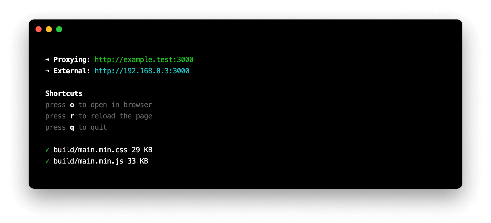

# TMBR Bundler

A configurable JavaScript and SASS bundler built on [esbuild](https://esbuild.github.io) and [browser-sync](https://browsersync.io). Intended for WordPress development or projects where a CI/CD workflow is not available, allowing for concurrent development and production bundles.

**Why [esbuild](https://esbuild.github.io)?**

Compared to the mess of webpack loaders and dependencies, esbuild is faster, has better documentation and zero dependencies by default. It was created by Evan Wallace, who built this amazing [WebGL demo](https://madebyevan.com/webgl-water) in 2011 ... oh yeah, and he also co-founded [Figma](https://www.figma.com/)!

## Installation

```bash
npm install -D @tmbr/bundler
```

## Usage
`@tmbr/bundler` has two commands - `build` and `watch` - that both create concurrent bundles:
- `build/main.dev.[css|js]` development version with sourcemaps
- `build/main.min.[css|js]` minified production version

### ``bundler build``

This command creates the build files noted above and displays KB sizes for the minified css and js build files.

### ``bundler watch``

This command will create initial build files noted above and start watching for changes. By default, it will look at the **name** field in your `package.json` file, append `.test` and proxy
`http://example.test:3000` for auto-reloading.



## Configuration

A second argument can be passed after `build` or `watch` to allow for overriding the default options. This should be a relative path to a file that includes named exports for build, watch and / or serve. If an export returns an object, it will be shallow merged into the bundler's options. Alternatively, an exported function will receive the default options and expect a returned object.

`bundler watch bundler.config.js`<br>`bundler build bundler.config.js`

### Examples

#### Change output directory
```js
export const build = {
  outdir: 'dist'
};

export const watch = {
  outdir: 'dist'
};
```

#### Change [browser-sync](https://browsersync.io/docs/options) options
```js
export const serve = {
  port: 5000
};
